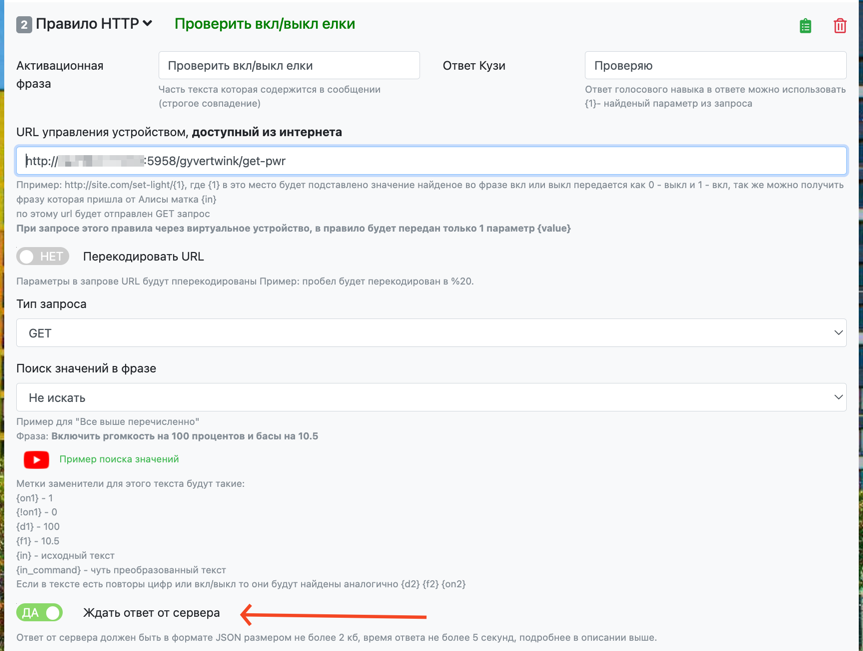
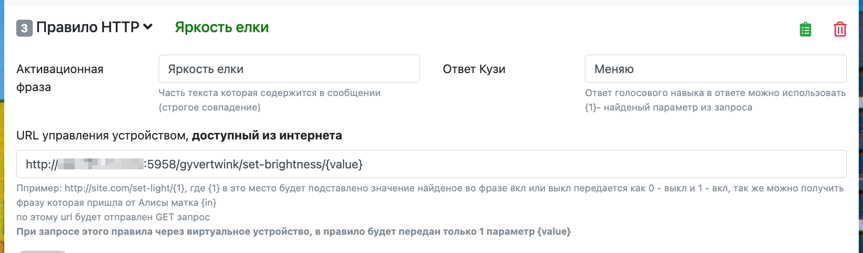
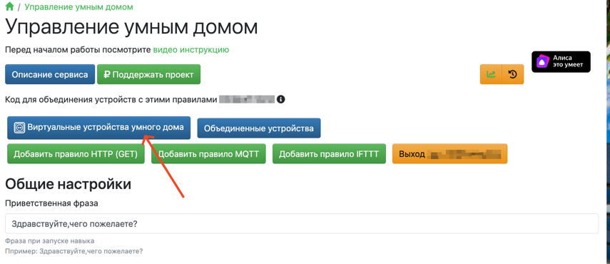

# GyverTwink-IOT

Я сделал этот проект, чтобы дать себе возможность управлять гирляндой GyverTwink на своей ёлке при помощи Яндекс Алисы.

---

## Хочу также! Как завести?

Для работы всей схемы вам понадобятся:
- Сама гирлянда GyverTwink [(сайт проекта)](https://alexgyver.ru/gyvertwink/) [(github)](https://github.com/AlexGyver/GyverTwink)
- Какой-нибудь дополнительный сервер в той же сети, что и гирлянда, который будет включен 24/7. 

  Это может быть как ваш персональный компьютер, так и отдельное решение. Я использую одноплатный компьютер Raspberry PI 0W.
- Дополнительный удалённый сервер с белым IP (если у вас нет белого IP)
> [!NOTE]  
> Ранее я использовал ngrok, но из-за санкций он перестал работать в РФ. Бесплатные и публичные решения остались и сейчас, но данный репозиторий заточен под использование своего сервера, так что разбирайтесь. 

---

### Шаг 1: Настройка удалённого сервера

Поскольку у большинства людей нет белого IP, для управления гирляндой из интернета, трафик необходимо будет туннеллировать.
Для этого можно использовать готовые и бесплатные сервисы _(вроде ngrok, если вы не в РФ, или localhost.run)_, либо можно поднять аналог на своём удалённом сервере. Я покажу как реализовать второй вариант.

На вашем сервере должна быть установлена Ubuntu (с другими системами не проверял. если установили что-то другое - разбирайтесь).

1. Для работы, вам необходимо установить Docker на своём сервере. Сделать это можно следующей командой:
```shell
curl -fsSL https://get.docker.com | sh -
```

2. Следом, создаём на сервере папку `frpsdocker` и переходим в неё
```shell
mkdir frpsdocker
cd frpsdocker
```

3. Далее, создаём там файл `docker-compose.yml` со следующим содержимым
```yaml
version: "3.8"

services:
  server:
    image: snowdreamtech/frps:0.60
    network_mode: host
    restart: unless-stopped

    volumes:
     - "./frps.toml:/etc/frp/frps.toml"
```

4. А рядом создаём файл `frps.toml` со следующим содержимым
```toml
bindPort = 7000
vhostHTTPPort = 8080

auth.method = "token"
auth.token = "<любой пароль>"
```

В последней строке придумываем и вписываем любой пароль. Он необходим, чтобы через наш сервер не смог туннеллироваться кто попало.

5. Следом, запускаем программу
```shell
docker compose up -d
```

---

### Шаг 2: Настройка сервера в локальной сети
1. Первым делом, вам необходимо узнать IP-адрес своей гирлянды в локальной сети. Сделать это можно, зайдя в настройки роутера, или же посмотрев в приложении GyverTwink


Для моей гирлянды - это `192.168.1.36` (У вас адрес может отличаться). Запомните или запишите свой адрес.

2. Для работы, вам необходимо установить Docker на своём сервере. Сделать это можно следующей командой:
```shell
curl -fsSL https://get.docker.com | sh -
```

3. После установки, создаём папку `twink-iot` на сервере и переходим в неё
```shell
mkdir twink-iot
cd twink-iot
```

4. Скачиваем туда файлы `docker-compose.yml` и `frpc.toml` из репозитория
```shell
wget https://github.com/barabum0/twink-iot/raw/refs/heads/master/docker-compose.yml
wget https://github.com/barabum0/twink-iot/raw/refs/heads/master/frpc.toml
```

5. Далее, в файле `docker-compose.yml` в строке
```yaml
environment:
  GYVERTWINK__IP: 192.168.1.36
```
меняем IP-адрес гирлянды на тот, что мы получили ранее

6. Далее, в файле `frpc.toml` в строках
```toml
serverAddr = "<server address>"
```
и
```toml
auth.token = "<your token>"
```
вписываем IP-адрес нашего **УДАЛЁННОГО** сервера и пароль, который мы ранее вписали при настройке **УДАЛЁННОГО** сервера.

7. Следом, запускаем программу
```shell
docker compose up -d
```

Для проверки работоспособности, попробуйте включить вашу гирлянду, перейдя по такой ссылке:
```text
http://<ip-адрес удалённого сервера>:5958/gyvertwink/set-pwr/1
```

---

### Шаг 3: Настройка "Домовёнка Кузи"

Для связи нашей гирлянды с Яндекс Алисой мы будем использовать навык "Домовёнок Кузя". Этот навык позволяет создавать свои устройства в системе умного дома Яндекса.

1. Переходим по ссылке: https://alexstar.ru/smarthome

2. Нажимаем "Войти через Яндекс"


3. Входим
4. Добавляем первое правило, нажав на кнопку "Добавить правило HTTP (GET)"

5. Настраиваем это правило следующим образом

В URL вписываем следующую ссылку:
    ```text
    http://<ip-адрес удалённого сервера>:5958/gyvertwink/set-pwr/{value}
    ```
6. Создаём второе правило, настроив его следующим образом

В URL вписываем следующую ссылку:
    ```text
    http://<ip-адрес удалённого сервера>:5958/gyvertwink/get-pwr
    ```
> [!IMPORTANT]  
> Не забудьте включить переключатель "Ждать ответ от сервера"

7. Аналогично, создаём третье правило

В URL вписываем следующую ссылку:
    ```text
    http://<ip-адрес удалённого сервера>:5958/gyvertwink/set-brightness/{value}
    ```
8. Далее, переходим в менеджер устройств, нажав на кнопку "Виртуальные устройства умного дома"

9. Создаём новое устройство с типом "Лампа"

10. Настраиваем его как показано ниже


Готово!
